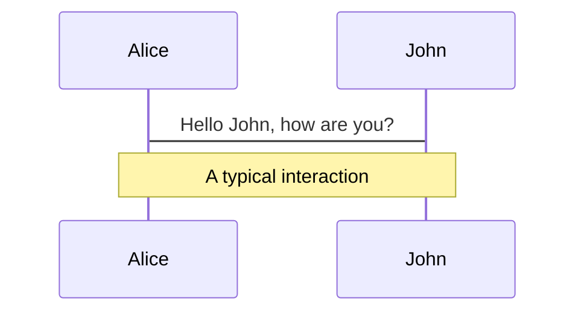
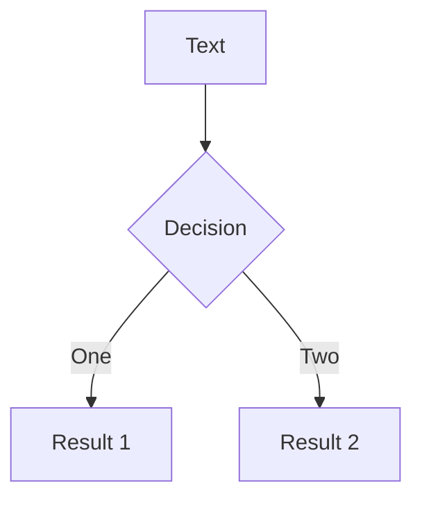
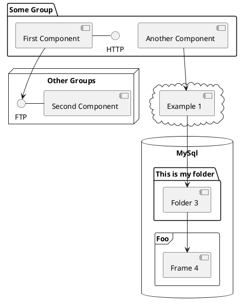

# ZauberAI (frontend future?)

## Introduction on improving development productivity with artificial intelligence

> Programming has two parts to it: <br /><br />
> **‘think hard about a problem and try to understand it’** and <br /><br />
> **‘map those small pieces into existing code**’.<br /><br />
> The second part is tedious, but it’s what Codex is best at.<br /><br />
> <small>--<cite>Greg Brockman, CTO OpenAI</cite></small>

<!--
Presenter Notes ...
-->

---
layout: center
---

# GPT-3

## all over the media these days ...

---
layout: default
---

# What is GPT-3?

## Generative Pre-trained Transformer 3

- developed by OpenAI
- autoregressive language model
- uses deep learning
- trained on 175 billion parameters
- API, different models available

## Applications

- Codex, CoPilot, ... > code generation
- CodexDB > query generation based on natural language
- copy.ai, jasper.ai, writesonic.com, rytr.com > text generation
- Excelformulabot > Excel formula generation from natural language
- chat bots
- ...

<!-- presenter notes --->


---
layout: default
---

# short thought of AI use cases
## In which areas can an AI for priorIT support developers?

- writing code (HTML, CSS, Javascript / TypeScript, SQL, Java, ...)
- analyzing and reviewing code (does code apply to solid principles?)
- debugging
- help / reference
- research, learning & documentation
- form- / UI builder

## Where could AI extend our product portfolio?

- natural language search (e.g. text input filling 80-something science search fields)
- recognizing and analyzing unusual activity
- trend detection (text classification)
- end-user-help (chat bots)
- ...


<!-- presenter notes --->

---

# AI limitations

## examples from the codex AI model

- not yet able to understand code in its entirety (generating vs understanding code)
- not yet good enough to assist with complex functions
- trained via GitHub, can provide mediocre code quality
- relying too much on codex produced code without human review
- copyright issues not yet fully legally judged (trained by GitHub code ...)
- personal and sensitive information leaks through code? (using public AI systems)

## assist, don't replace

- all of the above limitations are being worked on
- we should not forget that AI is not a replacement for human developers, but rather a tool to assist them
- although all its limitations, AI can still be a great help to developers and a big productivity booster
- many big companies are already using AI to assist their developers


<!-- presenter notes --->

---
layout: center
---
# selected AI tools

## worth to give it a shot

---
layout: two-cols
---

## code generation tools

- <small>&#128279;</small> [CoPilot AI Pair Programmer](https://github.com/features/copilot)
  - GitHub, Microsoft
- <small>&#128279;</small> [Codex OpenAI model](https://openai.com/blog/codex/)
  - API used by CodePilot
- <small>&#128279;</small> [GPT-3 Chat](https://chat.openai.com/chat)
  - chat with a large language model trained by OpenAI
- <small>&#128279;</small> [tabnine](https://www.tabnine.com/)
  - AI based code completion
  - hosted or local version
  - custom, spezialized, self-trained models
  - clear self-owned copyright license
- <small>&#128279;</small> [GhostWriter](https://replit.com/site/ghostwriter)
  - code generation, suggestions, refactoring, explanations
- <small>&#128279;</small> [K-Explorer AI](https://k-explorer.com)

::right::

## other AI tools

- <small>&#128279;</small> [CodexDB](https://codexdb.ai/)
  - query generation based on natural language  
- <small>&#128279;</small> [Microsoft sketch2code](https://www.microsoft.com/en-us/ai/ai-lab-sketch2code)
  - convert hand-written drawings to working HTML prototypes
- <small>&#128279;</small> [teleporthq](https://teleporthq.io/)
  - code generation from UI design
- <small>&#128279;</small> [zecoda](https://zecoda.com/)
  - code generation from UI design
- <small>&#128279;</small> [animaap](https://www.animaapp.com/)
  -  code generation from UI design

## could be custom built

- Figma to Angular Page / Form Component
- custom UI builder (https://mui.com/ to react)

<!-- Presenter Notes ... --->

---
layout: center
---

# let's see some examples

<!-- Presenter Notes ... --->

---

# GitHub Copilot

<br />
<br />

## Angular example

<br />
<br />

- create Accounts Model
- create Accounts Service
- Accounts Component: Observable loading accounts via service
- Accounts Component: create html table with accounts
- calculate Service: REGEX
- calculate Service: Observables / Streams

<!-- Presenter Notes ... --->

---

# OpenAI GPT-3 Chat

- Quicksearch Algorithm
- Sorting multi-dimensional Arrays in typescript with typed code examples
- [Stack Overflow Example](https://stackoverflow.com/questions/66835273/looking-to-optimize-a-typescript-function)
  - simplify and optimize typescript function
  - SOLID principles or clean code principles
- Angular Auxiliary Routes
- adding data to routes in Angular
- Angular Change Detection
- Angular ngFor optimization
- add cypress command for intercepting and managing all outgoing requests
- 15 REST API best practices
- ...


<!-- Presenter Notes ... --->

---

# Vision - automate repetetive tasks

## Frontend

- definition of design system
- definition of UI model
- technology / framework agnostic
- mostly generic, AI aided code generation
- mostly generic UI generation
- software lifecycle independent from technology / framework

## Backend
- definition of data model
- AI aided database management
- AI aided code generation for REST services, gRPC services, cloud functions, ...
- focus on business logic

---
layout: two-cols
---

# summary of intended use:

<br /><br />

- ## aid code generation<br /><br />

- ## aid code debugging<br /><br />

- ## aid code review and analysis<br /><br />

- ## help / reference<br /><br />

- ## research, learning & documentation<br /><br />

- ## form- / UI builder<br /><br />

::right::

# increased productivity

<br /><br />

- ## natural language search (e.g. text input filling 80-something science search fields)<br /><br />
- ## recognizing and analyzing unusual activity<br /><br />
- ## trend detection (text classification)<br /><br />

- ## end-user-help (intelligent chat bots and wizards)<br /><br />

- ...


---

# interesting reads

- [Application of Deep Learning in Front-end Web Development (HTML + CSS)](https://becominghuman.ai/application-of-deep-learning-in-front-end-web-development-html-css-b7ef744705f3)
- [What’s the Difference Between Deep Learning Training and Inference?](https://blogs.nvidia.com/blog/2016/08/22/difference-deep-learning-training-inference-ai/)
- [How you can train an AI to convert your design mockups into HTML and CSS](https://www.freecodecamp.org/news/how-you-can-train-an-ai-to-convert-your-design-mockups-into-html-and-css-cc7afd82fed4)
- [pix2code paper: Generating Code from a Graphical User Interface Screenshot](https://arxiv.org/pdf/1705.07962.pdf)
- [Sketching Interfaces - Generating code from low fidelity wireframes](https://airbnb.design/sketching-interfaces/)
- [Automated front-end development using deep learning](https://blog.insightdatascience.com/automated-front-end-development-using-deep-learning-3169dd086e82)
- [ChatGPT: Optimizing Language Models for Dialogue](https://openai.com/blog/chatgpt/)
- [Characteristics and limitations of Azure OpenAI Service](https://learn.microsoft.com/en-us/legal/cognitive-services/openai/characteristics-and-limitations)
- [Copilot: GitHub’s AI Tool Speeds Up Development, but Comes with Risks](https://rewind.com/blog/copilot-github-ai-tool-security-risks/)
- [Is GitHub Copilot A Threat To Developers?](https://blog.openreplay.com/is-github-copilot-a-threat-to-developers/)
- [GitHub Copilot Isn't Worth the Risk](https://www.kolide.com/blog/github-copilot-isn-t-worth-the-risk)
- [Risk Assessment of GitHub Copilot](https://gist.github.com/0xabad1dea/be18e11beb2e12433d93475d72016902)
- [Is GitHub Copilot a blessing, or a curse?](https://gist.github.com/0xabad1dea/be18e11beb2e12433d93475d72016902)

---
layout: center
---

# Thank you for your attention!


---

# What is Slidev?

Slidev is a slides maker and presenter designed for developers, consist of the following features

- 📝 **Text-based** - focus on the content with Markdown, and then style them later
- 🎨 **Themable** - theme can be shared and used with npm packages
- 🧑‍💻 **Developer Friendly** - code highlighting, live coding with autocompletion
- 🤹 **Interactive** - embedding Vue components to enhance your expressions
- 🎥 **Recording** - built-in recording and camera view
- 📤 **Portable** - export into PDF, PNGs, or even a hostable SPA
- 🛠 **Hackable** - anything possible on a webpage

<br>
<br>

Read more about [Why Slidev?](https://sli.dev/guide/why)

<!--
You can have `style` tag in markdown to override the style for the current page.
Learn more: https://sli.dev/guide/syntax#embedded-styles
-->

<style>
h1 {
  background-color: #2B90B6;
  background-image: linear-gradient(45deg, #4EC5D4 10%, #146b8c 20%);
  background-size: 100%;
  -webkit-background-clip: text;
  -moz-background-clip: text;
  -webkit-text-fill-color: transparent;
  -moz-text-fill-color: transparent;
}
</style>

<!--
Here is another comment.
-->

---

# Navigation

Hover on the bottom-left corner to see the navigation's controls panel, [learn more](https://sli.dev/guide/navigation.html)

### Keyboard Shortcuts

|     |     |
| --- | --- |
| <kbd>right</kbd> / <kbd>space</kbd>| next animation or slide |
| <kbd>left</kbd>  / <kbd>shift</kbd><kbd>space</kbd> | previous animation or slide |
| <kbd>up</kbd> | previous slide |
| <kbd>down</kbd> | next slide |

<!-- https://sli.dev/guide/animations.html#click-animations -->

<p v-after class="absolute bottom-23 left-45 opacity-30 transform -rotate-10">Here!</p>

---
layout: image-right
image: https://source.unsplash.com/collection/94734566/1920x1080
---

# Code

Use code snippets and get the highlighting directly![^1]

```ts {all|2|1-6|9|all}
interface User {
  id: number
  firstName: string
  lastName: string
  role: string
}

function updateUser(id: number, update: User) {
  const user = getUser(id)
  const newUser = { ...user, ...update }
  saveUser(id, newUser)
}
```

<arrow v-click="3" x1="400" y1="420" x2="230" y2="330" color="#564" width="3" arrowSize="1" />

[^1]: [Learn More](https://sli.dev/guide/syntax.html#line-highlighting)

<style>
.footnotes-sep {
  @apply mt-20 opacity-10;
}
.footnotes {
  @apply text-sm opacity-75;
}
.footnote-backref {
  display: none;
}
</style>

---

# Components

<div grid="~ cols-2 gap-4">
<div>

You can use Vue components directly inside your slides.

We have provided a few built-in components like `<Tweet/>` and `<Youtube/>` that you can use directly. And adding your custom components is also super easy.

```html
<Counter :count="10" />
```

<!-- ./components/Counter.vue -->
<Counter :count="10" m="t-4" />

Check out [the guides](https://sli.dev/builtin/components.html) for more.

</div>
<div>

```html
<Tweet id="1390115482657726468" />
```

<Tweet id="1390115482657726468" scale="0.65" />

</div>
</div>

<!--
Presenter note with **bold**, *italic*, and ~~striked~~ text.

Also, HTML elements are valid:
<div class="flex w-full">
  <span style="flex-grow: 1;">Left content</span>
  <span>Right content</span>
</div>
-->


---
class: px-20
---

# Themes

Slidev comes with powerful theming support. Themes can provide styles, layouts, components, or even configurations for tools. Switching between themes by just **one edit** in your frontmatter:

<div grid="~ cols-2 gap-2" m="-t-2">

```yaml
---
theme: default
---
```

```yaml
---
theme: seriph
---
```


</div>

Read more about [How to use a theme](https://sli.dev/themes/use.html) and
check out the [Awesome Themes Gallery](https://sli.dev/themes/gallery.html).

---
preload: false
---

# Animations

Animations are powered by [@vueuse/motion](https://motion.vueuse.org/).

```html
<div
  v-motion
  :initial="{ x: -80 }"
  :enter="{ x: 0 }">
  Slidev
</div>
```

<div class="w-60 relative mt-6">
  <div class="relative w-40 h-40">
    
    
    
  </div>

  <div
    class="text-5xl absolute top-14 left-40 text-[#2B90B6] -z-1"
    v-motion
    :initial="{ x: -80, opacity: 0}"
    :enter="{ x: 0, opacity: 1, transition: { delay: 2000, duration: 1000 } }">
    Slidev
  </div>
</div>

<!-- vue script setup scripts can be directly used in markdown, and will only affects current page -->
<script setup lang="ts">
const final = {
  x: 0,
  y: 0,
  rotate: 0,
  scale: 1,
  transition: {
    type: 'spring',
    damping: 10,
    stiffness: 20,
    mass: 2
  }
}
</script>

<div
  v-motion
  :initial="{ x:35, y: 40, opacity: 0}"
  :enter="{ y: 0, opacity: 1, transition: { delay: 3500 } }">

[Learn More](https://sli.dev/guide/animations.html#motion)

</div>

---

# LaTeX

LaTeX is supported out-of-box powered by [KaTeX](https://katex.org/).

<br>

Inline $\sqrt{3x-1}+(1+x)^2$

Block
$$
\begin{array}{c}

\nabla \times \vec{\mathbf{B}} -\, \frac1c\, \frac{\partial\vec{\mathbf{E}}}{\partial t} &
= \frac{4\pi}{c}\vec{\mathbf{j}}    \nabla \cdot \vec{\mathbf{E}} & = 4 \pi \rho \\

\nabla \times \vec{\mathbf{E}}\, +\, \frac1c\, \frac{\partial\vec{\mathbf{B}}}{\partial t} & = \vec{\mathbf{0}} \\

\nabla \cdot \vec{\mathbf{B}} & = 0

\end{array}
$$

<br>

[Learn more](https://sli.dev/guide/syntax#latex)

---

# Diagrams

You can create diagrams / graphs from textual descriptions, directly in your Markdown.

<div class="grid grid-cols-3 gap-10 pt-4 -mb-6">







</div>

[Learn More](https://sli.dev/guide/syntax.html#diagrams)

---
src: ./pages/multiple-entries.md
hide: false
---

---
layout: center
class: text-center
---

# Learn More

[Documentations](https://sli.dev) · [GitHub](https://github.com/slidevjs/slidev) · [Showcases](https://sli.dev/showcases.html)
